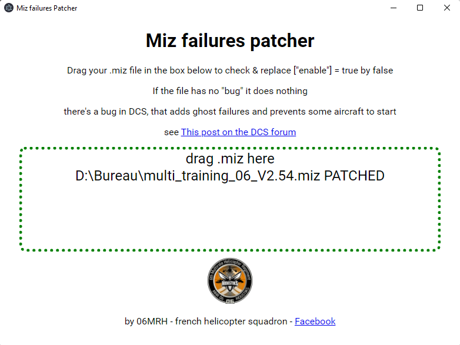

# PatchMiz

PatchMiz is a tool to patch DCS .miz files when they are "corrupted" with ghost failures.

in 2022, jan, there's a know bug ( read here https://forums.eagle.ru/topic/290929-ka50-engine-start-failure-after-mission-edition/?_fromLogin=1 ) that sometimes add "ghost" failures to into the .miz file.

I quickly created a tool, both as an exercice for myself and to help my friends to quickly check their .miz after edition (and automatically patch them if an issue is detected)

## Installation

### Environment

it requires node.js and uses electron and electron-packager to build.

### Option 1 - Down download the project and build the app

run

    cd src
    npm install

to install npm packages , then

    npm run build

to build the app with electron-packager

on windows it creates a folder named patchmiz-win32-x64

### Option 2 - use the pre-built .zip

Download the built and unzip it.
https://github.com/Cerppo/patchMiz/releases/latest

## Usage

Open the folder "Patchmiz-win32-x64" and launch the patchmiz.exe

You can now drag & drop your .miz file into the dotted box
it reads / search and patch to a new file if the failure is found ( extension .miz.patched )

You should se a green dotted border and a message if so.

You can now rename the patched file as you wish and play the mission ( don't edit it before or it could add the bug again ! )
